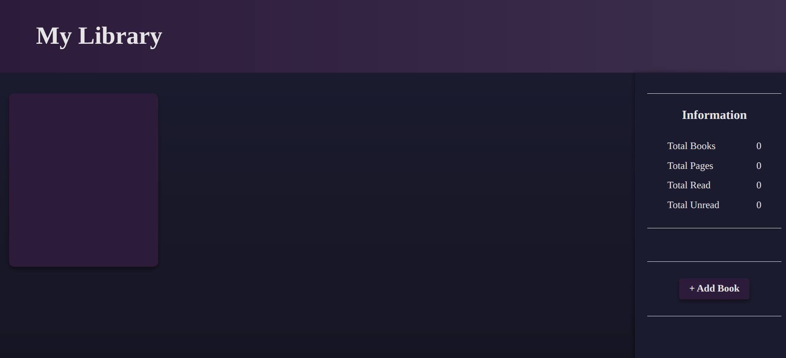

# My Library 📚

A modern, responsive web application for managing your personal book collection. Built with vanilla JavaScript, HTML, and CSS, this library app provides an intuitive interface for tracking your reading progress and organizing your books with beautiful animations and smooth interactions.



## ✨ Features

- **Book Management**: Add new books to your library with detailed information
- **Automatic Cover Images**: Fetches book covers automatically from Open Library API
- **Reading Progress Tracking**: Mark books as read or unread with real-time updates
- **Statistics Dashboard**: View total books, pages, and reading progress with live updates
- **Modern UI**: Clean, dark theme with purple accents and smooth animations
- **Responsive Design**: Works seamlessly across different screen sizes
- **Interactive Cards**: 3D flip animations with hover effects
- **Smooth Scrolling**: Custom scroll behavior for better user experience
- **Data Persistence**: Books are saved locally using localStorage
- **Form Validation**: Real-time character counting and validation

## 🚀 Getting Started

### Prerequisites

- A modern web browser (Chrome, Firefox, Safari, Edge)
- No additional dependencies required - runs entirely in the browser

### Installation

1. Clone the repository:

```bash
git clone https://github.com/ReMoOuZz/Library.git
cd library
```

2. Open `index.html` in your web browser or serve it using a local server:

```bash
# Using Python
python -m http.server 8000

# Using Node.js (if you have http-server installed)
npx http-server

# Using PHP
php -S localhost:8000
```

3. Navigate to `http://localhost:8000` in your browser

## 📖 Usage

### Adding a Book

1. Click the **"+ Add Book"** button in the sidebar
2. Fill in the book details:
   - **Title**: The book's title (required)
   - **Author**: The book's author (required)
   - **Pages**: Number of pages (required)
   - **Summary**: A brief description (max 200 characters, required)
3. Click **"Add Book"** to save

### Managing Books

- **View Details**: Hover over any book card to flip it and see details
- **Change Status**: Use the dropdown to mark books as "Read" or "Unread"
- **Delete Books**: Click the "×" button to remove books from your library
- **Scroll Summary**: Use mouse wheel for smooth scrolling in book summaries

### Viewing Statistics

The sidebar displays real-time statistics:

- Total number of books in your library
- Total pages across all books
- Number of books read
- Number of books unread

## 🛠️ Technical Details

### Architecture

- **Frontend**: Vanilla JavaScript, HTML5, CSS3
- **API Integration**: Open Library API for book cover images
- **Data Storage**: localStorage for data persistence
- **Styling**: Custom CSS with CSS Grid, Flexbox, and CSS Variables
- **Animations**: CSS transitions and transforms for smooth interactions

### CSS Variables System

The project uses a comprehensive CSS variables system for consistent theming:

```css
:root {
  /* Colors */
  --primary-bg: #1b1b2f;
  --secondary-bg: #2d1b3a;
  --accent-color: #c084fc;

  /* Gradients */
  --header-gradient: linear-gradient(90deg, #2d1b3a 0%, #3b2f4c 100%);

  /* Shadows */
  --shadow-medium: 0 4px 8px rgba(0, 0, 0, 0.4);

  /* Spacing */
  --spacing-md: 1em;

  /* Transitions */
  --transition-normal: 0.3s ease;
}
```

### File Structure

```
Library/
├── features/
│   └── reset.css          # CSS reset styles
├── images/
│   ├── Screenshot.png     # Application screenshot
│   └── default-image.png  # Default book cover
├── index.html             # Main HTML file
├── main.css              # Main stylesheet with CSS variables
├── main.js               # JavaScript functionality
└── README.md             # This file
```

### Key Components

- **Book Constructor**: Creates book objects with unique IDs
- **Cover Image Fetcher**: Integrates with Open Library API
- **Popup Modal**: Smooth animations for adding books
- **Statistics Calculator**: Real-time updates of library metrics
- **Local Storage Manager**: Handles data persistence
- **Custom Scroll Handler**: Smooth scrolling in book summaries

## 🎨 Design Features

- **Dark Theme**: Easy on the eyes with purple accents
- **CSS Variables**: Centralized theming system for easy customization
- **Smooth Animations**: CSS transitions for enhanced UX
- **3D Flip Cards**: Interactive book cards with hover effects
- **Grid Layout**: Responsive book card grid
- **Modal Design**: Clean popup for adding books
- **Custom Scrollbars**: Styled scrollbars for better aesthetics
- **Hover Effects**: Interactive elements with visual feedback

## 🔧 Development

### Current Status

- ✅ Basic book addition functionality
- ✅ Cover image integration with fallback
- ✅ Statistics dashboard with real-time updates
- ✅ Modern UI design with CSS variables
- ✅ Responsive layout with CSS Grid
- ✅ Interactive 3D flip cards
- ✅ Local storage for data persistence
- ✅ Custom scroll behavior
- ✅ Form validation and character counting
- ✅ Book deletion functionality
- ✅ Reading status management

### Planned Features

- [ ] Search and filter functionality
- [ ] Book editing capabilities
- [ ] Export/import library data
- [ ] Multiple reading lists
- [ ] Book ratings and reviews
- [ ] Reading progress tracking (pages read)
- [ ] Book categories and tags
- [ ] Reading goals and challenges
- [ ] Dark/light theme toggle
- [ ] Mobile app version

## 🎯 Performance Optimizations

- **Efficient DOM Manipulation**: Minimal re-renders
- **Optimized API Calls**: Single API call per book
- **CSS Variables**: Reduced CSS file size
- **Smooth Animations**: Hardware-accelerated transforms
- **Local Storage**: Fast data access

## 🤝 Contributing

1. Fork the repository
2. Create a feature branch (`git checkout -b feature/AmazingFeature`)
3. Commit your changes (`git commit -m 'Add some AmazingFeature'`)
4. Push to the branch (`git push origin feature/AmazingFeature`)
5. Open a Pull Request

### Development Guidelines

- Follow the existing CSS variables system
- Maintain the dark theme aesthetic
- Ensure responsive design compatibility
- Add smooth animations for new interactions
- Test localStorage functionality

## 📝 License

This project is open source and available under the [MIT License](LICENSE).

## 🙏 Acknowledgments

- [Open Library](https://openlibrary.org/) for providing book cover images
- CSS Grid and Flexbox for responsive layouts
- Vanilla JavaScript community for best practices
- CSS Variables for modern theming approaches

---

**Happy Reading! 📖✨**
